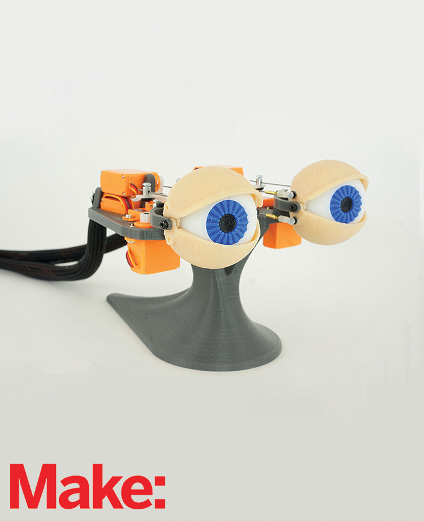

# Animatronic-Eyes
3D printable files and source code for Brian Roe's Animatronic Eyes project in the Make: 3D Printing Projects book. To get the book with full instructions on how to build this project: http://amzn.to/1LADC7N

We appreciate, but do not require, attribution. An attribution usually includes the title, author, publisher, and ISBN. For example: “_Make: 3D Printing Projects_ by Brook Drumm and James Floyd Kelly (Make). Copyright 2016, 978-1-4571-8724-7.”
